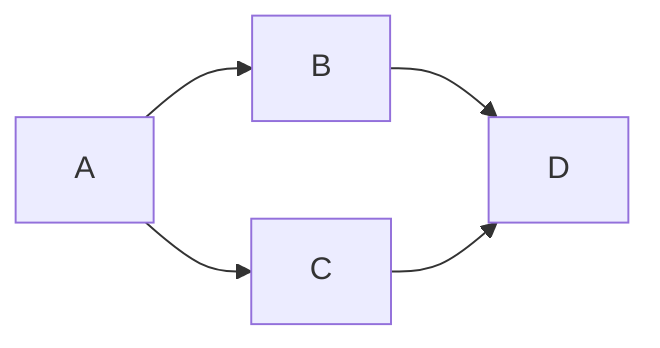

# Slidev Theme Gravitek

Theme for training presentations by Gravitek.

---

# What is Slidev?

Slidev is a slide maker and presentation tool designed for developers. It
includes the following features:

- 📝 **Text-based** - focus on your content with Markdown, then style it later
- 🎨 **Themable** - themes can be shared and reused as npm packages
- 🧑‍💻 **Developer Friendly** - code highlighting, live coding with autocompletion
- 🤹 **Interactive** - embed Vue components to enhance your expressions
- 🎥 **Recording** - built-in recording and camera view
- 📤 **Portable** - export to PDF, PPTX, PNGs, or even a hostable SPA
- 🛠 **Hackable** - virtually anything that's possible on a webpage is possible
  in Slidev

<br>
<br>

Read more about [Why Slidev?](https://sli.dev/guide/why)

---

# Navigation

Hover on the bottom-left corner to see the navigation's controls panel

## Keyboard Shortcuts

|                                                      |                             |
| ---------------------------------------------------- | --------------------------- |
| <kbd>space</kbd> / <kbd>tab</kbd> / <kbd>right</kbd> | next animation or slide     |
| <kbd>left</kbd> / <kbd>shift</kbd><kbd>space</kbd>   | previous animation or slide |
| <kbd>up</kbd>                                        | previous slide              |
| <kbd>down</kbd>                                      | next slide                  |

---
layout: image-right 
image: https://cover.sli.dev
---

# Code

Use code snippets and get the highlighting directly!

```ts
interface User {
  id: number;
  firstName: string;
  lastName: string;
  role: string;
}

function updateUser(id: number, update: Partial<User>) {
  const user = getUser(id);
  const newUser = { ...user, ...update };
  saveUser(id, newUser);
}
```

---
layout: section
---

# Simple Section

---
layout: section
---

# Simple Section 2

With an complementary paragraph to explain more in detail what you want to say.

---
layout: default
---

# Simple slide example

## H2 Subtitle of the page

An introduction paragraph.

### H3 Title of a block

- Item 1
- Item 2
- Item 3

A classic paragraph to explain more in detail what you want to say.

Another paragraph to add more information.

### Second block

You can also use **Markdown** syntax to create rich text content in your slides.

#### H4 Title for a schema or code block

---
layout: two-cols
layoutClass: gap-8
---

# Two columns example

## First paragraph

- Item 1
- Item 2
- Item 3

## Second paragraph

You can also use **Markdown** syntax to create rich text content in your slides.

::right::

#### H4 Schema title



#### H4 Code title

```yaml
apiVersion: pkg.crossplane.io/v1
kind: Provider
metadata:
  name: provider-aws-s3
spec:
  package: xpkg.upbound.io/upbound/provider-aws-s3:v1.14.0
  # 🆕 Provider Revisions - manage upgrades safely
  revisionActivationPolicy: Automatic
  revisionHistoryLimit: 3
```

---
layout: center 
class: "text-center"
---

# Learn More

[Documentation](https://sli.dev) /
[GitHub Repo](https://github.com/slidevjs/slidev)
